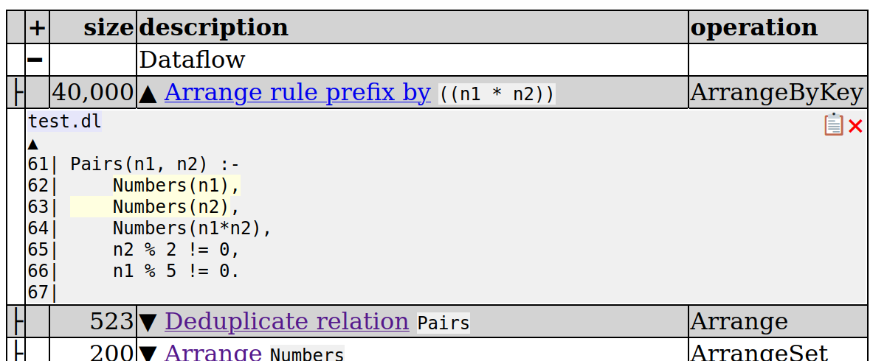

# Tutorial: Profiling DDlog Programs

**TODO**: Add a running example.

DDlog's profiling features are designed to help the programmer identify
parts of the program that use the most CPU and memory.  DDlog supports
two profilers:

- DDlog's **self-profiler** runs as a thread inside the DDlog program and generates
  textual memory and CPU profiles that can be output at any point
  during the runtime of the program.

- [**DDShow**](https://github.com/Kixiron/ddshow) is a standalone profiler that
  ingests performance-related events from DDlog or any other program using
  Timely Dataflow and produces a visual profile that can be explored in a
  browser, as well as a textual profile similar to the one generated by
  the self-profiler.

DDShow offers a richer (and growing) set of features and is the preferred
development-time profiler.  The self-profiler, on the other hand, is more
resource-efficient and can be even be enabled in the production environment to
troubleshoot performance issues.

The user can enable one of the two profilers when starting a DDlog program
either from the CLI or via the Rust, C, or Java API.


## Self-profiling

To enable self-profiling, pass the `--self-profiler` flag to the
DDlog-generated CLI executable:

```
./tutorial_ddlog/target/release/tutorial_cli --self-profiler < tutorial.dat
```

In Rust, use the `run_with_config()` function:
    ```
    // Create a DDlog configuration with 1 worker thread and with the self-profiling feature
    // enabled.
    let config = Config::new()
        .with_timely_workers(1)
        .with_profiling_config(ProfilingConfig::SelfProfiling {
            // Directory to store profiles under or `None` for current directory.
            profile_directory: None
        });
    // Instantiate the DDlog program with this configuration.
    let (hddlog, init_state) = tutorial_ddlog::run_with_config(config, false)?;
    ```

In C, use the `ddlog_run_with_config()` function:
    ```
    TODO
    ```

In Java, use the `DDlogConfig` class to create a DDlog configuration with self-profiling enabled:
    ```
    import ddlogapi.DDlogAPI;
    import ddlogapi.DDlogConfig;

    DDlogConfig config = new DDlogConfig(2);
    config.setProfilingConfig(DDlogConfig.selfProfiling());
    this.api = new DDlogAPI(config, false);
    ```

When self-profiling is enabled, DDlog supports several profiling commands
(also available through Rust, C, and Java APIs):

1. `profile cpu on/off;` - enables/disables recording of CPU usage info in
addition to memory profiling.  CPU profiling is not enabled by default, as
it can slow down the program somewhat, especially for large programs
that handle many small updates.

1. `profile change on/off;` - enables/disables recording of the number of
insertions and deletions per arrangement, used to construct arrangement
change profile (see below).

1. `profile;` - dumps CPU and memory profiles to an HTML file.  This command
can be invoked at any time during program execution to output performance data
accumulated so far.  The profile attributes program's CPU and memory usage to
individual DDlog operators, highlightling program hotspots and
informing potential optimizations.

  As an example, consider the following rule that computes all pairs of values
`(n1,n2)` such that `n1`, `n2`, and their product all belong to the `Numbers`
relation and additionaly `n1` is not divisible by `5` and `n2` is not divisible
by `2`

  ``` 
  Pairs(n1, n2) :-
      Numbers(n1),
      Numbers(n2),
      Numbers(n1*n2),
      n1 % 5 != 0,
      n2 % 2 != 0.
  ```

  We run the above program, initializing the `Numbers` relation to contain all
numbers in the range `[0..200]` The following screenshot shows a fragment of the
resulting CPU profile.  The top record in the profile, titled "Dataflow", shows
the amount of CPU time used to execute the entire dataflow, in this case,
`380,792` microseconds.  The next several profile records show that most of this
time is spent evaluating the above rule, and so this is where we should focus
our optimization effort.  In the screenshot we expanded the operator at the top
of the profile. This operator took `179,262` microseconds, or nearly 50% of the
entire program CPU time.


  In the expanded view we see the source code location of the operator in
question.  DDlog evaluates the rule by first computing all pairs `(n1, n2)` as a
Cartesian product of the `Numbers` relation with itself.  Next it joins the
resulting relation with `Numbers` in order to restrict it to only those pairs
whose product also belongs to `Numbers`.  To this end, it must first index
("arrange" in the differential dataflow terminology) this intermediate relation
comprised of pairs `(n1, n2)` using the value of expression `n1*n2` as a key.
This is what the operator at the top of the profile does.  Since the relation is
large, indexing it is an expensive operation.  We can confirm this by looking at
the arrangement size profile section on the same HTML page:



As expected, the size of the intermediate relation is `200 x 200 = 40,000`.
This suggests a simple optimization that prunes the sets of candidate values
of `n1` and `n2` early on:

  ``` 
  Pairs(n1, n2) :-
      Numbers(n1),
      n1 % 5 != 0,
      Numbers(n2),
      n2 % 2 != 0,
      Numbers(n1*n2).
  ```

  This reduces arrangement size by a factor of `2.5`


and the time to compute the arrangement by a factor of `3`:


  Consider the next operator in the profile, which computes the Cartesian product
of the set of `n1` such that `n1 % 5 != 0` with `Numbers(n2)`:


  We can reduce this time by first computing the set of `n2`, since `n2 % 2 != 0`
prunes more values than `n1 % 5 != 0`:

  ```
  Pairs(n1, n2) :-
      Numbers(n2),
      n2 % 2 != 0,
      Numbers(n1),
      n1 % 5 != 0,
      Numbers(n1*n2).
  ```

  Indeed, this shaves few more milliseconds of the program's CPU usage:


  Let us take a closer look at the arrangement size profile.  Arrangements are
responsible for the majority of memory consumption of a DDlog program.  Several
DDlog operators expect arranged inputs.  We already saw how a prefix of a rule
must be arranged in order to join it with a relation.  This is the first
arrangement in the profile shown below.  In addition, the relation to join with,
i.e., `Numbers`, must be arranged too.  This arrangement must be indexed by the
value of field `n` of the relation.  Arranged relations in DDlog are described
by **patterns**, e.g., `(Numbers{.n=_0}: Numbers)`, where numbered variables,
e.g., `_0`, indicate one or more fields used to index the relation by.


  The same relation may be arranged multiple times using different keys required
by different join operations.  For example, computing the Cartesian product of
the `Numbers` relation with itself requires indexing the relation by an empty
set of fields (a Cartesian product is a special case of the join operator with
an empty join key).  In fact, this arrangement is used twice, in the first and
the second argument of the product, which is why we see two separate code
fragments in the corresponding profile entry:


  There are several other kinds of arrangements in the profile, e.g., the
`group_by` operator arranges its input using group-by variables as a key.  Each
profile record contains a hyperlink to documentation that describes the meaning
of the associated operator.

  Note that in general arrangement size can be larger than the number of
elements in the underlying relation, since arrangements in Differential Dataflow
are stored as temporally indexed data structures where the same record can occur
multiple times with different weights.

  In addition to the arrangement size profile, the profiler outputs the peak
arrangement size profile, which records the largest number of elements observed
in each arrangement

  If change profiling was enabled for some parts of the execution, the profiler
also outputs the "Counts of changes" profile.  Unlike the arrangement size
profile, which tracks the number of records in each arrangment, this profile
shows the amount of churn.  For example adding one record and deleting one
record will show up as two changes in the change profile, but will cancel out in
the size profile.  Identifying relations that see the most churn helps to
understand the performance of the program, as such relations are responsible for
most recomputation performed by DDlog.  In a typical profiling session, the user
identifies expensive operators in the CPU profile and looks up the relations
that are inputs to this operator in the change profile to identify the ones with
high churn.

  When change profiling is disabled, the recording stops, but the previously
accumulated profile is preserved.  By selectively enabling change profiling for
a subset of transactions, the user can focus their analysis on specific parts of
the program, for example they may not be interested in the number of changes
during initial population of input relations, but may want to make sure that
subsequent small incremental input updates do not cause excessive churn in
derived relations.

## DDShow-based profiling

To use DDShow, first install it using `cargo`:

```
cargo install --git https://github.com/Kixiron/ddshow
```

DDShow supports two profiling modes:

1. Live profiling, where the target program streams performance-related events to DDShow
via network sockets.

1. Post-mortem profiling, where the target program writes profiling events to disk and DDShow
later scans the recording and constructs a program profile.

### Live profiling

The CLI executable supports several options that configure DDShow-based
profiling (use `--help` for a complete list).  The easiest way to enable live profiling is with
the `--ddshow` switch, which tells DDlog to start DDShow in the background
and connect to it.  Additionally, `--profile-differential` enables Differential Dataflow profiling.  By default,
DDlog only records Timely Dataflow events, which is sufficient to generate the
CPU profile of the program.  `--profile-differential` additionally enables
the recording of Differential Dataflow events, used to generate arrangement
size profile:

```
./tutorial_ddlog/target/release/tutorial_cli --ddshow --profile-differential < tutorial.dat > tutorial.dump

[0s] Waiting for 1 connection on 127.0.0.1:51317: connected to 1 trace source
[0/1, 0s] ⠂ Replaying timely events: 0 events, 0/s
[0/1, 0s] ⡀ Replaying timely events: 13361 events, 47630/s
```

Alternatively, you can start DDShow manually in a separate shell:

```
# Shell 1: start DDShow
ddshow --stream-encoding rkyv --differential --connections 2 --disable-timeline
[5s] ⠁ Waiting for 2 connections on 127.0.0.1:51317: connected to 0/2 sockets

# Shell 2: start target program;
./tutorial_ddlog/target/release/tutorial_cli -w 2 --profile-timely  --profile-differential  < tutorial.dat
```

Note the DDShow command-line arguments used above:
- `--stream-encoding rkyv` - use the `rkyv` format for event traces.  This is required when debugging DDlog applications.
- `--differential` - enable reading of the Differential Dataflow trace for arrangement size profiling.
- `--connections` - the number of timely worker threads in the target application.  This argument must match the `-w` DDlog CLI flag
- `--disable-timeline` - disable event timeline generation, which can be very expensive and slow to render for
  non-trivial programs.

### Post-mortem profiling

Use `--timely-trace-dir` and `--differential-trace-dir` to record performance events for
post-mortem profiling:

```
./tutorial_ddlog/target/release/tutorial_cli --timely-trace-dir "dd_trace" --differential-trace-dir "dd_trace"  < tutorial.dat

```

In Rust:
    ```
    TODO
    ```

In C:
    ```
    TODO
    ```

In Java:
    ```
    import ddlogapi.DDlogAPI;
    import ddlogapi.DDlogConfig;

    DDlogConfig config = new DDlogConfig(1);
    config.setProfilingConfig(
            DDlogConfig.timelyProfiling(
                DDlogConfig.logToDisk("timely_trace"),
                DDlogConfig.logDisabled(),
                DDlogConfig.logToDisk("timely_trace"))
            );
    this.api = new DDlogAPI(config, true);
    ```


**NOTE**: DDShow currently requires using the same directory for timely and differential traces.


Run `ddshow` to analyze recorded event traces:


```
ddshow --replay-logs dd_trace/

[0s] Loading Timely replay from dd_trace/: loaded 2 replay files
Press enter to finish loading trace data (this will cause data to not be fully processed)...
[0/1, 5s]   Finished replaying timely events: 36717 events, 17073/s
Processing data... done!
Wrote report file to report.txt
Wrote output graph to file:////home/lryzhyk/projects/differential-datalog/test/datalog_tests/dataflow-graph/graph.html
```

When running in either live or post-portem mode, DDShow generates a text report in `report.txt`
and an HTML profile in `dataflow-graph/graph.html`.
